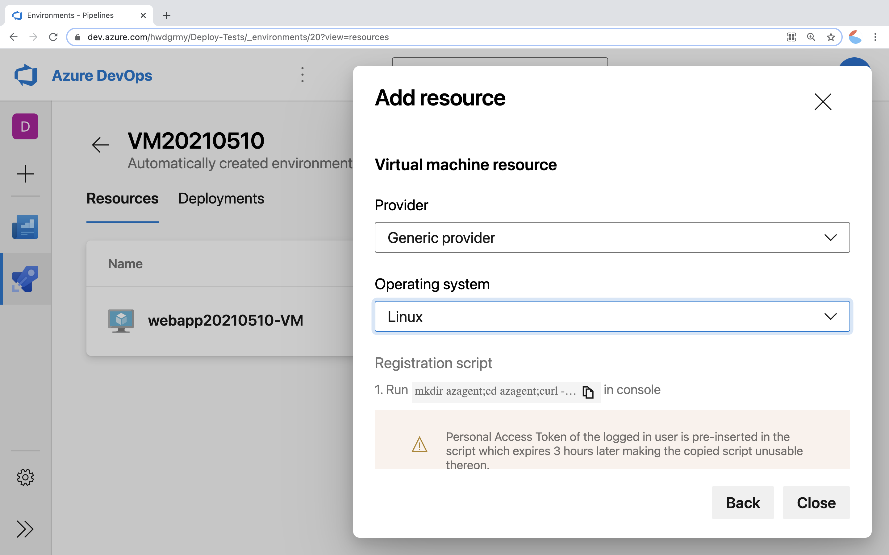
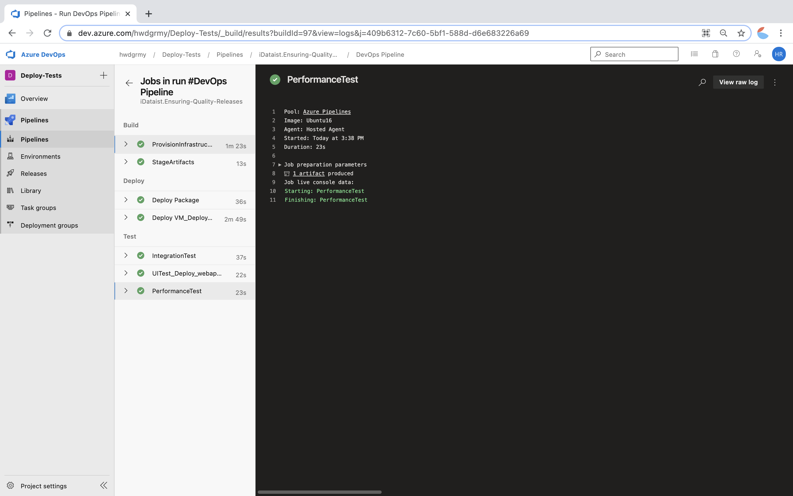
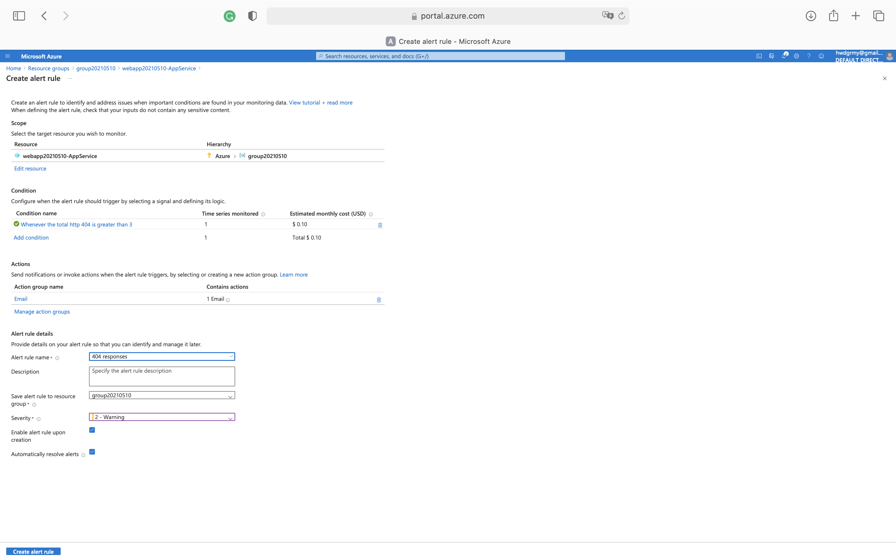
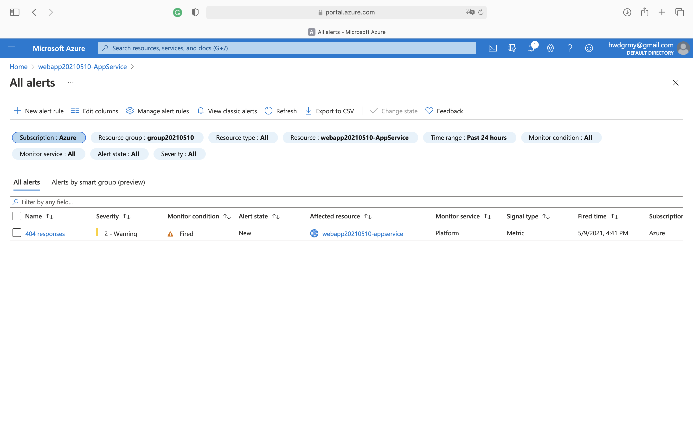
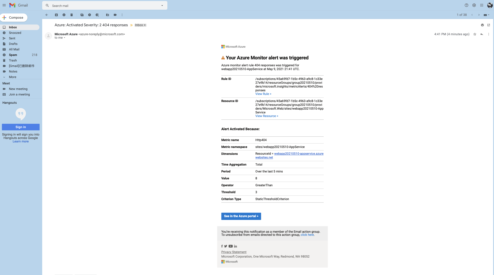
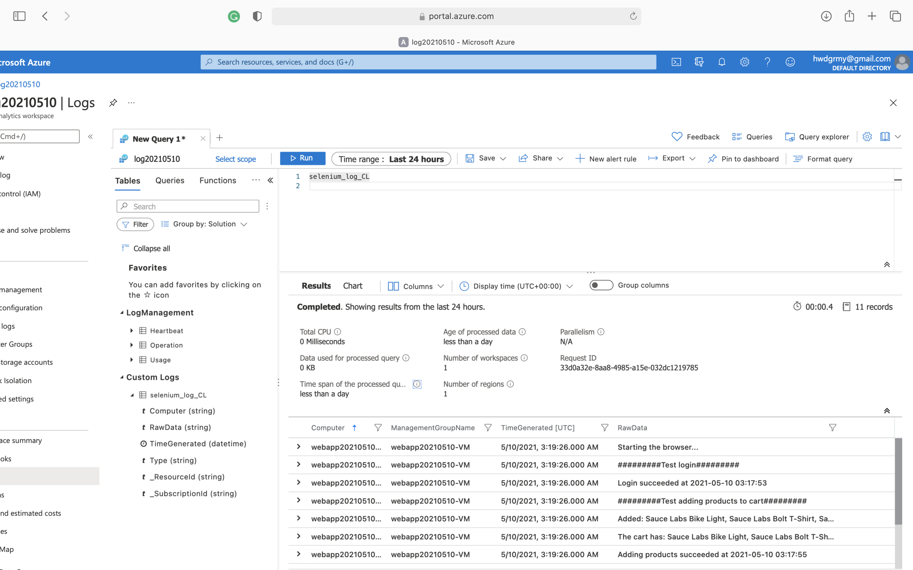

# Ensuring Quality Releases

## Overview
In this project, I created a disposable test environment and ran a variety of automated tests. In addition, I monitored the application’s behavior and determined root causes by querying the application’s custom log files. The project includes three main steps. First, I run a bash script to establish resources in Azure. Second, I built a CI/CD pipeline, which created a test environment using Terraform, deployed an application to the test environment, and executed load, integration, and functional tests. Lastly, I ingested logs and data from those tests into Azure Log Analytics to determine where failures may have occurred. 

## Dependencies
1. Create an [Azure Account](https://portal.azure.com) 
2. Install the [Azure command line interface](https://docs.microsoft.com/en-us/cli/azure/install-azure-cli?view=azure-cli-latest)
3. Create an [Azure DevOps Account](https://dev.azure.com/)

## Instructions and Output
1. Clone the GitHub Repo. Create a project in Azure DevOps. Modify the `resource.sh` script (line 82) to reflect the name of the project. Run `bash resource.sh` to spin up Azure resources, including storage account, key vault, and log analytics workspace. 
2. Push the changes to GitHub, which will trigger the Azure Pipeline to run automatically. The `Deploy_webapp20210510-VM` step will fail because the VM spun up by terraform has not been added to the environment. SSH into the VM (ssh [ADMIN]@[PUBLIC-IP]). Copy the registration script from Azure DevOps and run it from the SSH terminal. The pipeline should run successfully. 

3. Configure alerts for the webapp to monitor its behavior.

4. Ingest custom logs into Log Analytics and run queries.
